htmltools::includeCSS("https://raw.githubusercontent.com/jasoncookecon/SNAP_Distance/blob/main/my-css.css")

# Disclaimer

> Any opinions and conclusions expressed herein are those of the authors and do not reflect the views of the U.S. Census Bureau. The statistical summaries reported in this paper have been cleared by the Census Bureau's Disclosure Review Board release authorization number CBDRB-FY21-CES014- 049. All results have been reviewed to ensure that no confidential information is disclosed.


---

```{r, load_refs, include=FALSE, cache=FALSE}
library(RefManageR, here)
BibOptions(check.entries = FALSE,
         bib.style = "authoryear",
         cite.style = "authoryear",
         max.names = 2,
         sorting = "nty",
         style = "markdown",
         hyperlink = FALSE,
         dashed = TRUE)
bib <- RefManageR::ReadBib("SNAP_WIC.bib", check = FALSE)
```
```{r initialize, include = F}
if (!require("pacman")) install.packages("pacman")
pacman::p_load(grid, gridExtra,ggrepel, sp, foreign, dplyr, ggplot2, ggridges, tidyr, forcats, colortools, patchwork, plotly, dygraphs, knitr, kableExtra, formattable,datasets, reactable, htmltools, magick, timevis,ggpubr)

library(ggplot2, grid, reactable)
library(htmltools)
library(gridExtra)
library(ggridges)
library(dplyr)
library(tidyr)
library(forcats)
library(colortools)
library(patchwork)
library(ggrepel, plotly, dygraphs)
library(knitr, kableExtra, formattable)
library(datasets, readxl)
library(ggpubr)
crop <- function(im, left = 0, top = 0, right = 0, bottom = 0) {
 d <- dim(im[[1]]); w <- d[2]; h <- d[3]
 image_crop(im, glue::glue("{w-left-right}x{h-top-bottom}+{left}+{top}"))
}
```
```{r xaringanExtra-scribble, echo=FALSE}
xaringanExtra::use_xaringan_extra(c("tile_view", "freezeframe")) #, "scribble"
```

<!-- install.packages(c("pagedown", "xaringan")) -->
<!-- pagedown::chrome_print("C:/Users/Jason/Box/SNAP/Distance/Presentation/SNAP_Distance_Bitler_Cook_Porter.html") -->

# Motivation

- US somewhat unique within advanced economies in design of safety net. System very federalized with various levels of government running programs.

- People apply to many programs and rules not harmonized and application is not automatic as in much of the developed world $\Rightarrow$ low take-up is more of issue in US than other places (.smallest[.red[Currie, 2006; Currie and Gahvari, 2008]]). 

--

- Social program take-up: Hot topic in public econ, yet understudied.
  - Emphasis on understanding role of barriers to accessing safety net.
  
-  Barriers impact both .hi-red[take-up] (how many people enroll) and .hi-red[targeting] (what types of people enroll). 

`r RefManageR::NoCite(bib, c("Currie2006","Currie2008a"))`

---

# .smallest[Competing Models to Explain Low Take-Up]

## .hi-red[Neoclassical model]
- People make decisions balancing costs and benefits in a utility maximizing framework.

- Incomplete take-up is a function of barriers: 
  - **Incomplete information**: Program existence, eligibility rules.
  - **Stigma**: Either concerns about whether you should participate or about how others will judge you.
  - **Transaction costs**: E.g., travel costs, difficultly with documentation, time costs.

--

Under this framework, .hi-green[barriers could be efficient if improve targeting], i.e., deter those without need or target those in need .smallest[(.red[Ackerlof, 1978; Nichols & Zeckhauser, 1982; Besley & Coate, 1992; Kleven & Kopczuk, 2011])].

  
---
# .smallest[Competing Models to Explain Low Take-Up]

## .hi-red[Behavioral science  model] 
- Limited bandwidth or stress impairs people. Suggests incomplete take-up might be harmful or inefficient (.smallest[.red[Bertrand, Mullainathan, & Shafir, 2004]]).

## .hi-red[Administrative Burden] 
- Government actors may intentionally create "administrative burden" such as learning costs, compliance costs, and psychological costs to limit use, possibly due to limited capacity (.smallest[.red[Herd and Moynihan, 2019]]).


Under these models, .hi-red[barriers could be inefficient if worsen targeting], e.g., if the poor face limited bandwidth or scarcity, more needy individuals could be deterred by hassle costs.<sup>*</sup>

.footnote[<sup>*</sup> Though take up and targeting alone are not enough to assess normative implications (.smallest[.red[Finkelstein & Notowidigdo, 2019]]).]

`r RefManageR::NoCite(bib, c("Akerlof1978a","Besley1992a", "Moffitt1983b", "Nichols1982", "Kleven2011","Bertrand2004a","Herd2019"))`


---
class: inverse, middle
count: false 

# Literature

---
# Literature

Literature can be conceptualized as studying how different types of barriers impact .red[take-up] and .red[targeting].

`r RefManageR::NoCite(bib, c("Finkelstein2019b"))`

---
# Information Barriers

- SNAP-eligible people often don't realize eligibility (.smallest[.red[Bartlett et al., 2004]]); providing information .hi-green[increases take-up] (.smallest[.red[Daponte, Sanders, & Taylor, 1999; Finkelstein and Notowidigdo, 2019]]).

- Information mailers .hi-red[induce less-needy] households to enroll in SNAP (.smallest[.red[Finkelstein and Notowidigdo, 2019]]).

---

# Transaction Costs 

- Application help .hi-green[increases take-up] (.smallest[.red[Schanzenbach, 2001; Finkelstein and Notowidigdo, 2019]]), but .hi-red[reduces targeting] (.smallest[.red[Finkelstein and Notowidigdo, 2019]]).

- Longer certification periods .hi-green[increase take-up] (.smallest[.red[Kabbani and Wilde, 2003]]) 

- Less time for recertification interviews $\rightarrow$ .hi-red[more churning] (.smallest[.red[Homonoff and Somerville, 2021]]).

- Simplified reporting requirements .hi-green[increase take-up] (.smallest[.red[Gray, 2018; Hanratty, 2006]]).

- Certification rules .hi-red[reduce take-up], but .hi-green[improve targeting] (.smallest[.red[Unrath, 2021]]).

- Automated application process .hi-red[decreases take-up], but .hi-green[improves targeting] (.smallest[.red[Wu, 2021]]).

--


No documented SNAP interventions .hi-green[increase take-up] & .hi-green[improve targeting].

`r RefManageR::NoCite(bib, c("Daponte1999","Bhargava2015","Deshpande2019","Ebenstein2010","Homonoff2020","Finkelstein2019b","Daponte1999","Bartlett2004","Bhargava2015","Armour2018","Bettinger2012","Schanzenbach2009","Kabbani2003b","Hanratty2006","Deshpande2019","Rossin-Slater2013","Ambrozek2021","Unrath2021a","Wu2021","Gray2018","Barnes2021","Barnes2021a","Whaley2021","Vasan2021"))`


---

# Our Contribution

- First assessment of how access to in-person assistance via opening/closing SNAP offices and SNAP-authorized stores impacts participation and targeting.

- Provide evidence that reducing transaction costs via access to SNAP offices .hi-green[increases participation] and .hi-green[improves targeting].

--

- Link Census data on .red[residential location] with .red[administrative SNAP data] and information on .purple[SNAP offices] and .purple[SNAP-authorized retailers].

- Not possible to study this question with existing surveys due to limited sample sizes and data quality issues.


- Study population within states and don’t have to focus samples with limited generalizability (previous RCT literature).


`r RefManageR::NoCite(bib, c("Handbury2021","Rossin-Slater2013","Meckel2020b"))`

---
class: inverse, middle
count: false 

# Institutional Background
---
# SNAP

- Backbone of US safety net.

- Only US safety net program available to nearly all low-income households.

- Means tested (income and asset tests) and includes work requirements for some households (i.e., ABAWDs).

- Certification periods typically 6-12 months (seniors 24+ months; ABAWD 3 months).
  - In-person or phone interview required along with income verification.

---
# SNAP
## Application Process

.pull-left[
- Some heterogeneity across states.

- Many states have online application portals and hotlines.

- Provide household information and records of income/assets.
]
.pull-right[
.center[
```{r out.width = '100%', echo = F}
"figs/AZ_online.png" %>%
 image_read() %>%
 crop(bottom = 600, top = 400, left=300, right=600)
```
```{r out.width = '75%', echo = F}
"figs/AZ_hotline.png" %>%
 image_read() %>%
 crop(bottom = 0, top = 0, left=0, right=0)
```

.caption[**Source**: Arizona Department of Economic Security Website.]
]
]

---
# SNAP 
## Role of SNAP Offices

- Provide in-person assistance navigating application process.

- **Application prevalence**: .hi-red[in-person] $>$ online $>$ fax $>$ email $>$ phone.

  - SNAP offices report that typically 80% of applications are in person.
  
- Typically provide resources to connect SNAP applicants to other assistance programs (e.g., HUD, TANF, Medicaid/Medicare, LEAP, WIC).

- Some offices allow .red[direct applications to other programs] (typically TANF, but also sometimes HUD and Medicaid).

- Some offices even help find jobs, daycare, and housing.


---
class: inverse, middle
count: false 

# Data
---

# Data

``` {r, data, echo=F, include=F}
data <- data.frame(
  id      = 1:17,
  state = c("AZ"  ,"CO"  , "HI" , "ID" , "IL" , "IN" , "KY" , "MD" , "MI" , "MS" , "ND" , "NJ" , "NY" , "OR" , "TN" , "UT" , "VA"),
  data_start   = c("2009","2012","2013","2010","2008","2004","2014","2006","2010","2010","2004","2006","2013","2009","2004","2012","2009"),
  data_end     = c("2018","2013","2018","2018","2016","2018","2018","2016","2016","2018","2018","2018","2018","2018","2018","2018","2013")
)

data_long <- data %>% pivot_longer(cols = starts_with("data_"),
                        names_to = "cat",
                        names_prefix = "data_"
)  %>% arrange(desc(state), value)

theme_set(theme_bw())


factor_var <- factor(data_long$state, 
                     order = TRUE,
                     levels=c("VA","UT","TN","OR","NY","NJ","ND","MS","MI","MD","KY","IN","IL","ID","HI","CO","AZ"))

data_long <- data_long %>%
                mutate(state = factor_var)

data_long %>% 
  ggplot(aes(x= value, y= state)) +
  geom_line(aes(group = id),color="grey")+
  geom_point( size=3, show.legend = FALSE) +
  labs(y="State", x="Year") + ggtitle("SNAP Data: \n Years Available") +
  theme_classic(24)+
  theme(axis.text.x = element_text(angle = 45, hjust = 1,family='Fira Sans'),
        axis.text.y = element_text(family='Fira Sans'),
        axis.title.x = element_text(face="bold", family='Fira Sans'),
        axis.title.y = element_text(face="bold", family='Fira Sans'),
        plot.title = element_text(color="#B2182B", face="bold", hjust = 0.5, family='Fira Sans')
        )

ggsave(
  "SNAP_data.png",
  path = 'C:/Users/Jason/Box/SNAP/Distance/Presentation/figs/',
  width = 14,height = 18.5,units = c("cm")
)
```

.pull-left[
- .hi-red[SNAP Administrative Data]

- Master Address File

- MAFARF

- HUD Administrative Data

- ACS

- HHS TANF Administrative Data

- Collected 243 SNAP office closings and 336 openings.
]
.pull-right[
 <!-- - **AZ** ('09-'18), **CO** ('12,'13), **HI** ('13-'18), **ID** ('10-'18), **IL** ('08-'16), **IN** ('04-'18) **KY** ('14-'18), **MD** ('09-'16), **MI** ('10-'16), **MS** ('10-'18), **ND** ('04-'18), **NJ** ('06-'18), **NY** ('13-'18), **OR** ('09-'18), **TN** ('04-'18), **UT** ('12-'18), **VA** ('09-'13) -->
.center[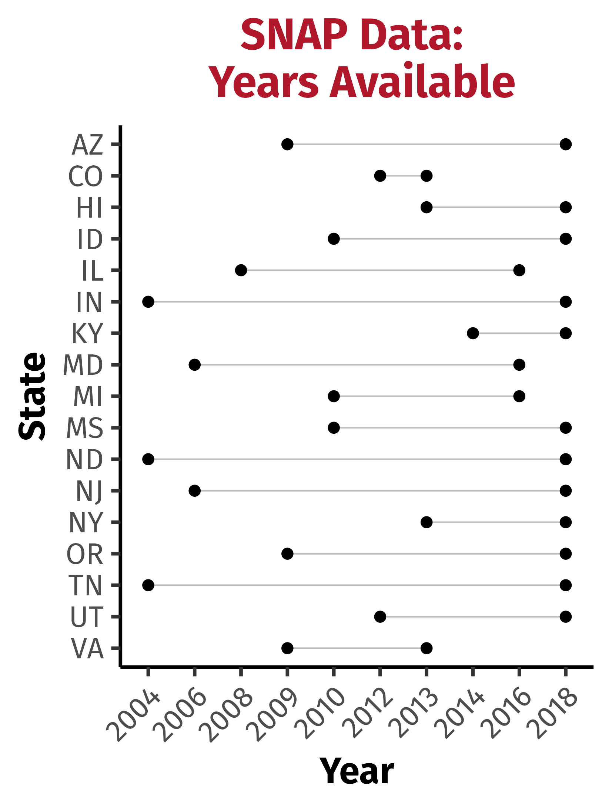]
]
---
class: inverse, middle
count: false 

# Measuring Access to SNAP Offices
---
# Measuring Access to SNAP Offices

- We count number of SNAP recipients in administrative records residing within given distance to each SNAP office in each year.

- In the case of overlap, we assign case to the closest office (i.e., .red["No Overlap"]).
  - Show robustness to counting cases multiple times if overlap

---

class: black-slide

.center[
```{r out.width = '70%', echo = F}
"figs/chicago_all.png" %>%
 image_read() %>%
 crop(bottom = 200, top = 0)
```
]
.caption[
**Data Source:** *SNAP-Authorized Stores* - USDA's Store Tracking and Redemption System (STARS); *SNAP Offices* - Collected by authors.
]

- Here, SNAP-authorized stores (dots) in 1 mile of SNAP Offices (diamonds).

---

class: black-slide

.center[
```{r out.width = '70%', echo = F}
"figs/chicago_nostreet.png" %>%
 image_read() %>%
 crop(bottom = 200, top = 0)
```
]
.caption[
**Data Source:** *SNAP-Authorized Stores* - USDA's Store Tracking and Redemption System (STARS); *SNAP Offices* - Collected by authors.
]

- Here, SNAP-authorized stores (dots) in 1 mile of SNAP Offices (diamonds).

- We assign dots to closest SNAP Office (signified by matching color).

- We then count number of dots assigned to each SNAP office each year.


---
class: black-slide

.center[
```{r out.width = '70%', echo = F}
"figs/chicago_nostreet.png" %>%
 image_read() %>%
 crop(bottom = 200, top = 0)
```
]
.caption[
**Data Source:** *SNAP-Authorized Stores* - USDA's Store Tracking and Redemption System (STARS); *SNAP Offices* - Collected by authors.
]

- In context of paper, the dots are SNAP admin cases.

- Compute counts for offices both before they open and after they close.

- Compute counts for various case types (e.g., no gross income)

---
# SNAP Offices


## Distances
- Most analyses focus on SNAP cases within **1 mile of the SNAP Office**.

  - Roughly **25th percentile** of distance distribution for both rural and urban counties.
  
- Also explore distances of $\color{#b92e34 }{(1,10]}$ miles for .hi-red[rural] and $\color{#07506F }{(1,4]}$ for .hi-blue[urban].

  - **75th percentile** of distance distribution.

---
class: inverse, middle
count: false 

# Share Affected by Openings/Closings

---
# Share Affected by Openings/Closings


```{r , include = F, echo=F}
library(grid)
#Plot shares of SNAP cases near offices and affected by closures

var <- c(rep("Opening & Closing", 4), 
         rep("Closing" , 4),
         rep("Opening" , 4),
         rep("Any Office" , 4))

factor_var <- factor(var, 
                     order = TRUE,
                     levels =c('Opening & Closing',
                               'Closing',
                               'Opening',
                               'Any Office'))
condition <- rep(c("Urban Counties: 1-4 Miles" ,
                   "Urban Counties: 0-1 Miles" ,
                   "Rural Counties: 1-10 Miles" ,
                   "Rural Counties: 0-1 Miles") , 4)
factor_condition <- factor(condition, 
                           order = TRUE,
                           levels =c('Urban Counties: 1-4 Miles',
                                     'Urban Counties: 0-1 Miles',
                                     'Rural Counties: 1-10 Miles',
                                     'Rural Counties: 0-1 Miles'))
#Coordflip reverses everything, so input the right way and flip it
value <- rev(c(
                0.155,.665,.2213,.5620, #Any
                0.025,.073,.0184,.0642, #Open
                0.028,.087,.0343,.0854, #Closing
                0.003,.010,.0013,.0036 #Open & Closing
               )
             ) 
data <- data.frame(factor_var,factor_condition,value) 

avg_share <- ggplot(data, aes(fill=factor_condition, y=value, x=factor_var)) + 
  geom_bar(position="dodge", stat="identity") + 
  scale_fill_manual("legend", values = c("Rural Counties: 0-1 Miles" = "#B2182B",
                                         "Rural Counties: 1-10 Miles" = "#F4A582",
                                         "Urban Counties: 0-1 Miles" = "#2166AC",
                                         "Urban Counties: 1-4 Miles" = "#92C5DE"),
                    breaks = c("Rural Counties: 0-1 Miles","Rural Counties: 1-10 Miles","Urban Counties: 0-1 Miles","Urban Counties: 1-4 Miles")) +
  coord_flip() +
  scale_y_continuous(name = 'Share')  +
  theme(axis.title.y=element_blank(), axis.title.x=element_blank(), legend.title = element_blank(),
        plot.title = element_text(size = 15, face = "bold",family='Fira Sans'),
        axis.text=element_text(size=12,family='Fira Sans'),
        axis.title=element_text(size=14,face="bold",family='Fira Sans')
  ) +
  labs(caption = bquote(bold("Data Source:")~" SNAP Administrative Data - various states and years.")
       )

avg_share
ggsave(
  "avg_share.png",
  path = 'C:/Users/Jason/Box/SNAP/Distance/Presentation/figs/',
  width = 18,height = 6.0,units = c("cm")
)
```
```{r out.width = '100%', echo = F}
"figs/avg_share.png" %>%
 image_read() %>%
 crop(bottom = 0, top = 0)
```
- **"Any Office":** All offices, including those that neither open nor close.
- **Meaningful share of recipients live near SNAP offices.**
- Of the .hi-red[27,540,000 rural clients] we observe: <sup>*<sup/>
  - 695,000 live < 1 mile of opening office (781,000 for closing office).
- Of the .hi-blue[24,590,000 urban clients] we observe:
  - 452,000 live < 1 mile of opening office (843,000 for closing office).
  
.footnote[<sup>*</sup>  Recall we only observe a subset of states in administrative data.]
---
# .smaller[Client Characteristics by SNAP Office Type]

```{r , include = F, echo=F}

var <- c(rep("Gross Income", 8), 
         rep("Benefit Amt" , 8),
         rep("Age" , 8))

factor_var <- factor(var, 
                     order = TRUE,
                     levels =c('Gross Income',
                               'Benefit Amt',
                               'Age'))
condition <- rep(c('Urban: 4+ Miles',
                   'Urban: Any',
                   'Urban, Closed: 0-1 Miles',
                   'Urban, Open: 0-1 Miles',
                   'Rural: 10+ Miles',
                   'Rural: Any',
                   'Rural, Closed: 0-1 Miles',
                   'Rural, Open: 0-1 Miles') , 3)
factor_condition <- factor(condition, 
                           order = TRUE,
                           levels =c('Urban: 4+ Miles',
                                     'Urban: Any',
                                     'Urban, Closed: 0-1 Miles',
                                     'Urban, Open: 0-1 Miles',
                                     'Rural: 10+ Miles',
                                     'Rural: Any',
                                     'Rural, Closed: 0-1 Miles',
                                     'Rural, Open: 0-1 Miles'))
#Coordflip reverses everything, so input the right way and flip it
value <- rev(c(
                27,27,28,28,28,28,29,28, #Age
                417,420,429,460,417,442,471,451, #Benefit Amt
                924,855,1120,1375,1068,937,1093,1304 #Gross income
                )) 
data <- data.frame(factor_var,factor_condition,value) 

char1 <- ggplot(data, aes(fill=factor_condition, y=value, x=factor_var)) + 
  geom_bar(position="dodge", stat="identity") + 
  scale_fill_manual("legend", values = c("Rural, Open: 0-1 Miles" = "#B2182B",
                                         "Rural, Closed: 0-1 Miles" = "#D6604D",
                                         "Rural: Any" = "#F4A582",
                                         "Rural: 10+ Miles" = "#FDDBC7",
                                         "Urban, Open: 0-1 Miles" = "#2166AC",
                                         "Urban, Closed: 0-1 Miles" = "#4393C3",
                                         "Urban: Any" = "#92C5DE",
                                         "Urban: 4+ Miles" = "#D1E5F0"),
                    breaks = c("Rural, Open: 0-1 Miles","Rural, Closed: 0-1 Miles","Rural: Any","Rural: 10+ Miles","Urban, Open: 0-1 Miles","Urban, Closed: 0-1 Miles","Urban: Any","Urban: 4+ Miles")) +
  coord_flip() +
  scale_y_continuous(name = '')  +
  theme(axis.title.y=element_blank(), axis.title.x=element_blank(),legend.title = element_blank(),
        plot.title = element_text(size = 15, face = "bold",family='Fira Sans'),
        axis.text=element_text(size=12,family='Fira Sans'),
        axis.title=element_text(size=14,face="bold",family='Fira Sans')
  ) +
  labs(caption = bquote(bold("Data Source:")~" SNAP Administrative Data - various states and years.")
       )

char1
ggsave(
  "char1.png",
  path = 'C:/Users/Jason/Box/SNAP/Distance/Presentation/figs/',
  width = 18,height = 7.5,units = c("cm")
)
```
.center[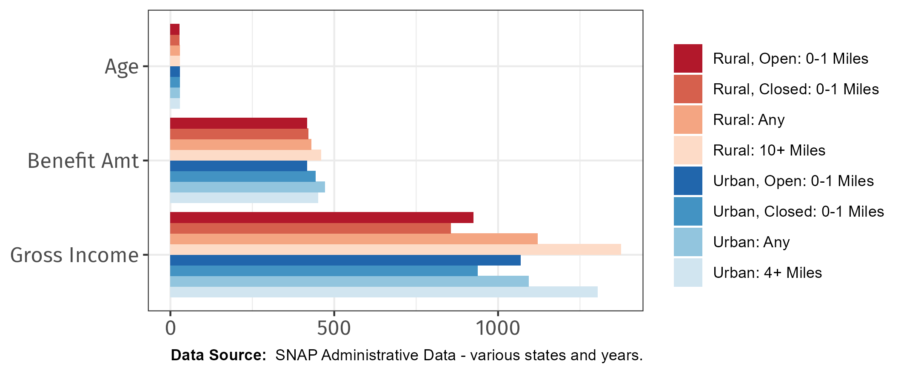]

- .hi-red[Rural]: Monthly income ~ $200 lower near **opening/closing** offices.
- .hi-blue[Urban]: Monthly income ~ $100 lower near **closing** offices.
- **All**: Monthly income higher for recipients far away from offices.

---

# .smaller[Client Characteristics by SNAP Office Type]

```{r , include = F, echo=F}

#Plot shares of SNAP cases near offices and affected by closures

var <- c(rep("White", 8), 
         rep("Hispanic" , 8),
         rep("Black" , 8),
         rep("Over 65" , 8))

factor_var <- factor(var, 
                     order = TRUE,
                     levels =c('White',
                               'Hispanic',
                               'Black',
                               'Over 65'))
condition <- rep(c('Urban: 4+ Miles',
                   'Urban: Any',
                   'Urban, Closed: 0-1 Miles',
                   'Urban, Open: 0-1 Miles',
                   'Rural: 10+ Miles',
                   'Rural: Any',
                   'Rural, Closed: 0-1 Miles',
                   'Rural, Open: 0-1 Miles') , 4)
factor_condition <- factor(condition, 
                           order = TRUE,
                           levels =c('Urban: 4+ Miles',
                                     'Urban: Any',
                                     'Urban, Closed: 0-1 Miles',
                                     'Urban, Open: 0-1 Miles',
                                     'Rural: 10+ Miles',
                                     'Rural: Any',
                                     'Rural, Closed: 0-1 Miles',
                                     'Rural, Open: 0-1 Miles'))
#Coordflip reverses everything, so input the right way and flip it
value <- rev(c(
                .04,.04,.05,.05,.06,.05,.07,.06, # Over 65
                .16,.18,.16,.06,.39,.53,.50,.33, # Black
                .11,.11,.14,.08,.18,.16,.17,.16, # Hispanic
                .75,.76,.70,.83,.46,.37,.36,.53 # White
               )) 
data <- data.frame(factor_var,factor_condition,value) 

char2 <- ggplot(data, aes(fill=factor_condition, y=value, x=factor_var)) + 
  geom_bar(position="dodge", stat="identity") + 
  scale_fill_manual("legend", values = c("Rural, Open: 0-1 Miles" = "#B2182B",
                                         "Rural, Closed: 0-1 Miles" = "#D6604D",
                                         "Rural: Any" = "#F4A582",
                                         "Rural: 10+ Miles" = "#FDDBC7",
                                         "Urban, Open: 0-1 Miles" = "#2166AC",
                                         "Urban, Closed: 0-1 Miles" = "#4393C3",
                                         "Urban: Any" = "#92C5DE",
                                         "Urban: 4+ Miles" = "#D1E5F0"),
                    breaks = c("Rural, Open: 0-1 Miles","Rural, Closed: 0-1 Miles","Rural: Any","Rural: 10+ Miles","Urban, Open: 0-1 Miles","Urban, Closed: 0-1 Miles","Urban: Any","Urban: 4+ Miles")) +
  coord_flip() +
  scale_y_continuous(name = '')  +
  theme(axis.title.y=element_blank(), axis.title.x=element_blank(),legend.title = element_blank(),
        plot.title = element_text(size = 15, face = "bold",family='Fira Sans'),
        axis.text=element_text(size=12,family='Fira Sans'),
        axis.title=element_text(size=14,face="bold",family='Fira Sans')
  ) +
  labs(caption = bquote(bold("Data Source:")~" SNAP Administrative Data - various states and years.")
       )

char2
ggsave(
  "char2.png",
  path = 'C:/Users/Jason/Box/SNAP/Distance/Presentation/figs/',
  width = 18,height = 7.5,units = c("cm")
)
```
.center[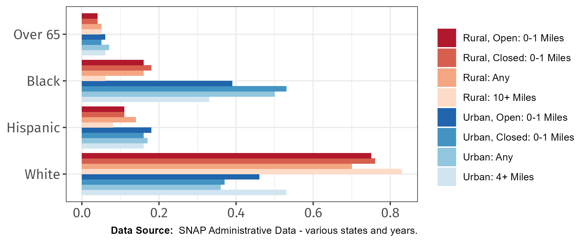]

- .hi-blue[Urban Counties]: Lower share of Black recipients near opening offices.

- **Both**: Recipients far away from offices are less likely to be Black/Hispanic and more likely to be White.

---

# .smaller[Client Characteristics by SNAP Office Type]

```{r , include = F, echo=F}

#Plot shares of SNAP cases near offices and affected by closures

var <- c(rep("Disabled", 8), 
         rep("Child" , 8),
         rep("Employed" , 8),
         rep("ABAWD" , 8))

factor_var <- factor(var, 
                     order = TRUE,
                     levels =c('Disabled',
                               'Child',
                               'Employed',
                               'ABAWD'))

condition <- rep(c('Urban: 4+ Miles',
                   'Urban: Any',
                   'Urban, Closed: 0-1 Miles',
                   'Urban, Open: 0-1 Miles',
                   'Rural: 10+ Miles',
                   'Rural: Any',
                   'Rural, Closed: 0-1 Miles',
                   'Rural, Open: 0-1 Miles') , 4)
factor_condition <- factor(condition, 
                           order = TRUE,
                           levels =c('Urban: 4+ Miles',
                                     'Urban: Any',
                                     'Urban, Closed: 0-1 Miles',
                                     'Urban, Open: 0-1 Miles',
                                     'Rural: 10+ Miles',
                                     'Rural: Any',
                                     'Rural, Closed: 0-1 Miles',
                                     'Rural, Open: 0-1 Miles'))
#Coordflip reverses everything, so input the right way and flip it
value <- rev(c(
                .22,.22,.23,.19,.21,.25,.22,.19, #ABAWD
                .37,.35,.38,.36,.37,.33,.34,.34, #Employed
                .41,.41,.40,.40,.42,.40,.40,.43, #Child
                .11,.11,.11,.09,.11,.12,.11,.08 #Disabled
            )) 
data <- data.frame(factor_var,factor_condition,value) 

char3 <- ggplot(data, aes(fill=factor_condition, y=value, x=factor_var)) + 
  geom_bar(position="dodge", stat="identity") + 
  scale_fill_manual("legend", values = c("Rural, Open: 0-1 Miles" = "#B2182B",
                                         "Rural, Closed: 0-1 Miles" = "#D6604D",
                                         "Rural: Any" = "#F4A582",
                                         "Rural: 10+ Miles" = "#FDDBC7",
                                         "Urban, Open: 0-1 Miles" = "#2166AC",
                                         "Urban, Closed: 0-1 Miles" = "#4393C3",
                                         "Urban: Any" = "#92C5DE",
                                         "Urban: 4+ Miles" = "#D1E5F0"),
                    breaks = c("Rural, Open: 0-1 Miles","Rural, Closed: 0-1 Miles","Rural: Any","Rural: 10+ Miles","Urban, Open: 0-1 Miles","Urban, Closed: 0-1 Miles","Urban: Any","Urban: 4+ Miles")) +
  coord_flip() +
  scale_y_continuous(name = '')  +
  theme(axis.title.y=element_blank(), axis.title.x=element_blank(),legend.title = element_blank(),
        plot.title = element_text(size = 15, face = "bold",family='Fira Sans'),
        axis.text=element_text(size=12,family='Fira Sans'),
        axis.title=element_text(size=14,face="bold",family='Fira Sans')
  ) +
  labs(caption = bquote(bold("Data Source:")~" SNAP Administrative Data - various states and years.")
       )

char3
ggsave(
  "char3.png",
  path = 'C:/Users/Jason/Box/SNAP/Distance/Presentation/figs/',
  width = 18,height = 7.5,units = c("cm")
)
```
.center[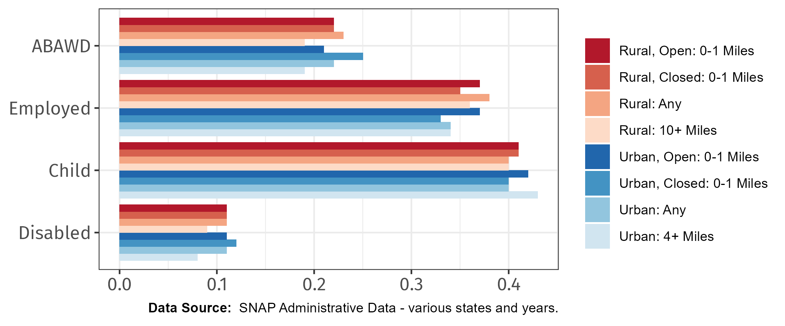]

- Characteristics relatively balanced across office type.

---
class: inverse, middle
count: false 

# Empirical Design


---

# Empirical Design

## Preferred Specification - Two-way Fixed Effects

$$y_{it} = \sum_{\tau, \tau\neq 1}\beta_\tau 1(t-E_i = \tau) + \gamma_i + \theta_t + \epsilon_{it}$$
- $i\ -$ SNAP office

- $t\ -$ calendar year

- $E_i\ -$ year of opening/closing

--

- Panel design hinges on exogenous timing of openings/closings.

  - Unobserved determinants of SNAP participation not differentially trending  across office types.


---

# Empirical Design

$$y_{it} = \sum_{\tau, \tau\neq 1}\beta_\tau 1(t-E_i = \tau)+  \gamma_i + \theta_t + \epsilon_{it}$$

- Run on a panel balanced over main event times $\tau \in [-3,3]$.

- Coefficients estimated for all event times, but only report $\tau \in [-3,3]$.

- Cluster standard errors by SNAP office (location where SNAP office will be/is/used to be).

--

- Sample includes all SNAP offices and event time is only calculated for treated offices (i.e., opening or closing).

- Test robustness to heterogeneous treatment effects (.smallest[.red[de Chaisemartin and D'Haultfœuille, 2020]]).
  
`r RefManageR::NoCite(bib, c("DeChaisemartin2020"))`  
  
---
# Empirical Design
## Exogeneity of our Variation

- Analysis only focuses on recipients in close vicinity of offices.
  - Office changes unlikely to target neighborhood characteristics in such close vicinity.
  
- Characteristics of SNAP recipients .red[near offices] relatively similar across office types (i.e., opening/closing/any).
  - **Caveat:** Urban offices tend to open in whiter neighborhoods and close in lower-income neighborhoods.
  
--

- Importantly, we leverage .red[timing] of changes.

---
class: inverse, middle
count: false 

# Results

---
# Mean Distance to Office (Miles)

- .hi-red[Goal:] Measure how travel distances are impacted by SNAP office openings/closings.

- Use the Census Master Address file (MAFX); a static file of all known residential locations in US.

- Measure average travel distance from every MAFX address within 1 of SNAP Office during years leading up to and following opening/closing.

---
# Mean Distance to Office (Miles)
.center[
``` {r, echo=F}
d<-data.frame(Type= c('Distance','Model','Avg. Estimate','Baseline Y','Event Study'), 
               cl_rur = c('0-1','TWFE','5.63***<br/>(1.16)', '.56','
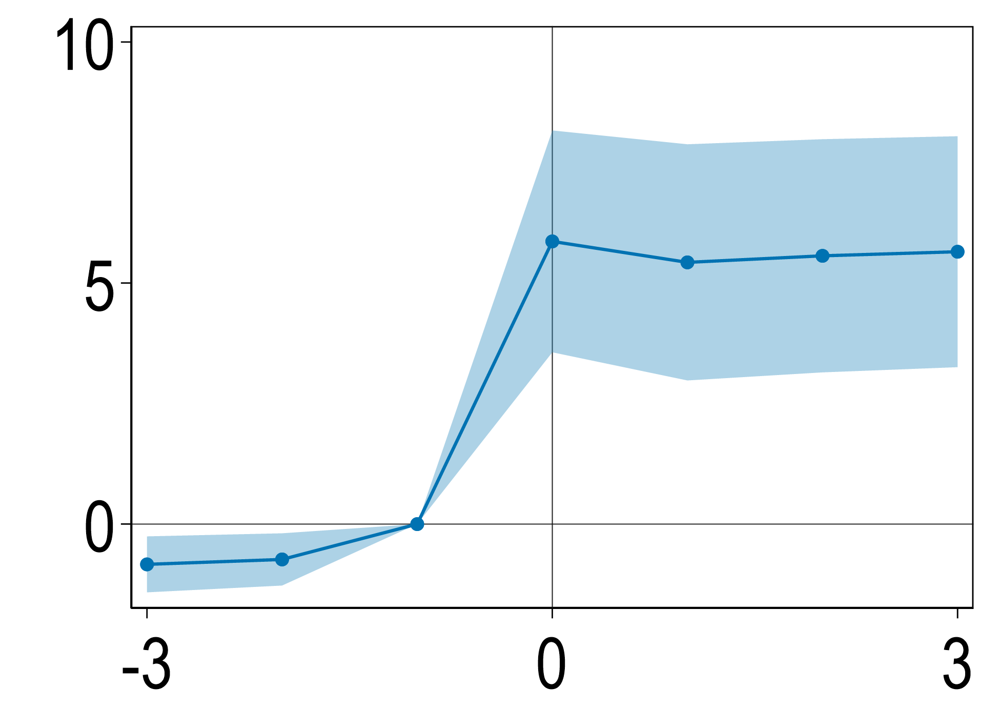'),
               cl_urb = c("0-1","TWFE","1.97***<br/>(0.70)",".63",'
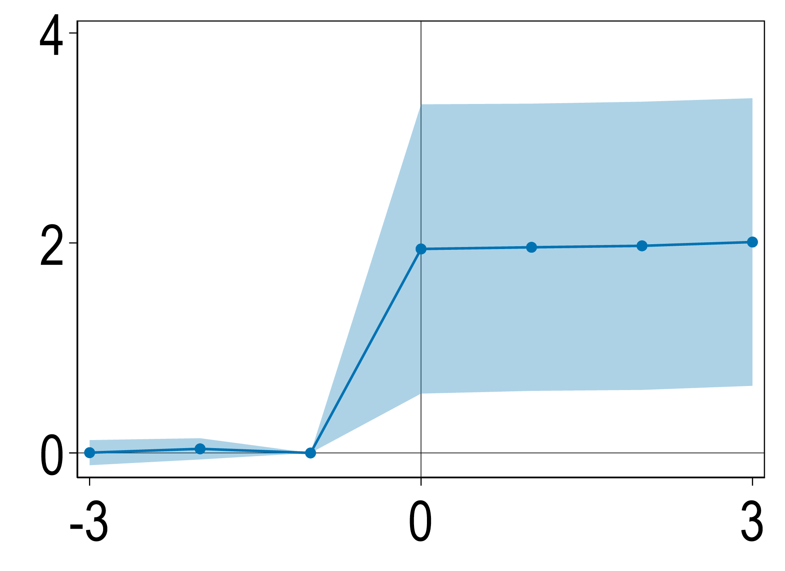'),
               op_rur = c("0-1","TWFE","-5.35***<br/>(1.03)","5.3",'
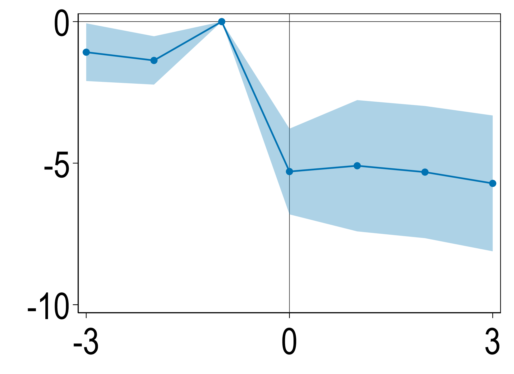'),
               op_urb = c("0-1","TWFE","-1.30***<br/>(0.26)","1.6",'
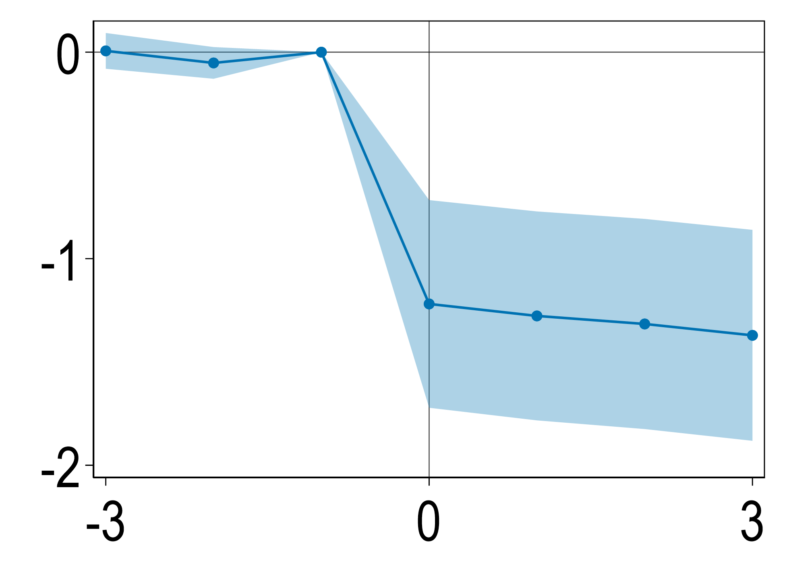')
)

d %>%
  kbl(booktabs = TRUE,col.names = c("","Closing<br/>Rural","Closing<br/>Urban","Opening<br/>Rural","Opening<br/>Urban"), escape = FALSE,
      align=c("c", 'c','c','c','c'), position="center"
  ) %>%
  kable_paper(full_width = FALSE) %>%
  kable_styling(full_width = FALSE, position="center") %>% 
  row_spec(0, align = "c") %>%
  column_spec(1, width = "4em") %>%
  column_spec(2, width = "7em",background ="#FDDBC7") %>%
  column_spec(3, width = "7em",background ="#D1E5F0") %>%
  column_spec(4, width = "7em",background ="#FDDBC7") %>%
  column_spec(5, width = "7em",background ="#D1E5F0") %>%
  row_spec(5, background ="white")
```
]
.caption[.center[
**Data Source:** SNAP Administrative Data - various states and years; Census Master Address File (MAFX).
]]

---
# Mean Distance to Office (Miles)

- .hi-red[Rural Counties]: Open/closings change average distance by 5 miles.

- .hi-blue[Urban Counties]: Open/closings change average distance by 1-2 miles.

- **Key Takeaway:** Distances change enough to move from office being walkable to requiring transit to access.

--

Next, we explore impact of SNAP office closings and openings on total counts of new SNAP clients living within a mile radius.

---
# \# of New SNAP Clients 
## Office Closings
.smallest[]
.pull-left[
```{r , include=T, echo = F}
d<-data.frame(Type= c('Distance','Model','Avg. Estimate','Baseline Y','Event Study'), 
               cl_rur = c('0-1','TWFE',"-3.17<br/>(12.6)","224",'
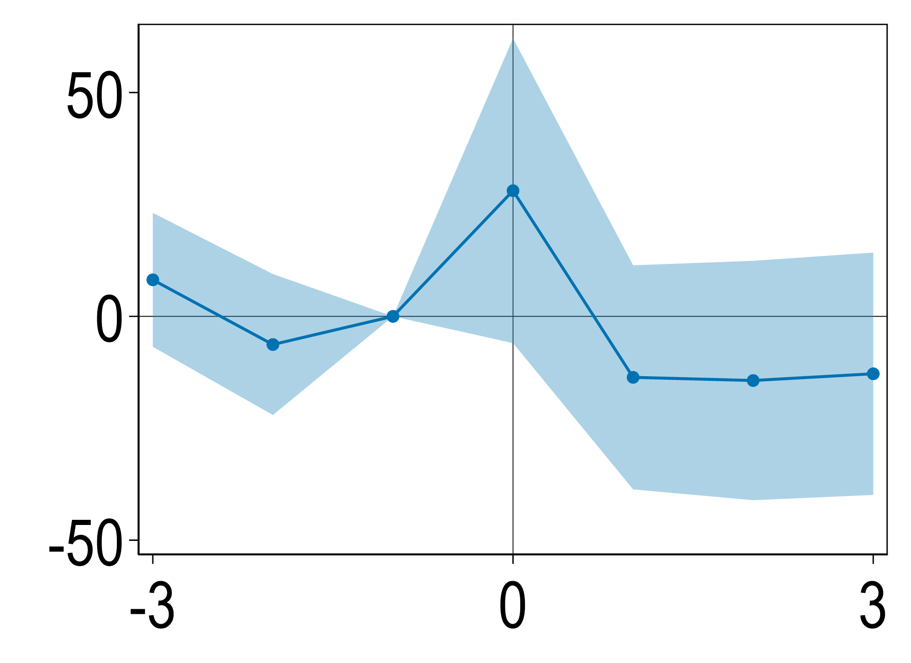'),
               cl_urb = c("0-1","TWFE","-88.0<br/>(62.5)","1,020",'
')
)


d %>%
  kbl(booktabs = TRUE,col.names = c("","Closing<br/>Rural","Closing<br/>Urban"), escape = FALSE,
      align=c("c", 'c','c'), position="center"
  ) %>%
  kable_paper(full_width = FALSE) %>%
  kable_styling(full_width = FALSE, position="center") %>% 
  row_spec(0, align = "c") %>%
  column_spec(1, width = "5em") %>%
  column_spec(2, width = "7em",background ="#FDDBC7") %>%
  column_spec(3, width = "7em",background ="#D1E5F0") %>%
  row_spec(5, background ="white")
```
.caption[.center[
**Data Source:** SNAP Administrative Data - various states and years.
]]
]
.pull-right[
- **Rural & Urban Counties**: Temporary spike during closing year.

- .hi-blue[Urban Counties:] 3 years after closing, roughly 90 fewer clients (.blue[8.8% decrease relative to baseline]).
]

---

# \# of New SNAP Clients
## Heterogeneity by Gross Income
.pull-left[
.center[
**Closing, Rural**
```{r out.width = '100%', echo = F}
"figs/cl_rur_fplhet_ES.png" %>%
 image_read() %>%
 crop(bottom = 0, top = 0, left=0, right=0)
```
]
]

.pull-right[
.center[
**Closing, Urban**
```{r out.width = '100%', echo = F}
"figs/cl_urb_fplhet_ES.png" %>%
 image_read() %>%
 crop(bottom = 0, top = 0, left=0, right=0)
```
]
]

.caption[.center[
**Data Source:** SNAP Administrative Data - various states and years.
]]

- **Puzzle:** Temporary spike driven by cases with gross income `\( \in (0,100] \)` %FPL.

- Participation falls for clients with no gross income.

---
# \# of New SNAP Clients
## Heterogeneity
```{r , include=F, echo = F}
#Rural Closing
val <- read.csv(file = 'temp/forest_plot_cl_rur.csv')

var <- rev(c("All","Age 65+","Age <5","White","Black/Hispanic","Single Parent","Employed","ABAWD","Disabled","Max Benefits","<50% Ben.","1 Month Churn","3-4 Month Churn","No GI","0<GI<50% FPL","50<GI<100% FPL","100<GI<130% FPL","130<GI<185% FPL"))

Label <- factor(var, 
               order = TRUE,
               levels =rev(c("All","Age 65+","Age <5","Black/Hispanic","White","Single Parent","Employed","ABAWD","Disabled","Max Benefits","<50% Ben.","1 Month Churn","3-4 Month Churn","No GI","0<GI<50% FPL","50<GI<100% FPL","100<GI<130% FPL","130<GI<185% FPL")))
              
data_rur_cl <- data.frame(Label,val)

p_rur_cl <- ggplot(data=data_rur_cl, aes(y=Label, x=est, xmin=ci_l, xmax=ci_u))+ 
      geom_point(color="Black", size=2)+ 
      geom_errorbarh(height=.1)+ #adds the CIs
labs(y = '', x="Average Over Post Periods") +
#adding a vertical line at the effect = 0 mark
geom_vline(xintercept=0, color="black", linetype="dashed", alpha=.5)+
#thematic stuff
ggtitle("Rural Closing")+
theme_minimal()+
theme(text=element_text(family="Times",size=12, color="black"))+
theme(panel.spacing = unit(1, "lines"))+
theme(plot.title = element_text(hjust = 0.5))

#Urban Closing
val <- read.csv(file = 'temp/forest_plot_cl_urb.csv')
              
data_urb_cl <- data.frame(Label,val)

p_urb_cl <- ggplot(data=data_urb_cl, aes(y=Label, x=est, xmin=ci_l, xmax=ci_u))+ 
      geom_point(color="Black", size=2)+ 
      geom_errorbarh(height=.1)+ #adds the CIs
labs(y = '', x="Average Over Post Periods") +
#adding a vertical line at the effect = 0 mark
geom_vline(xintercept=0, color="black", linetype="dashed", alpha=.5)+
#thematic stuff
ggtitle("Urban Closing")+
theme_minimal()+
theme(text=element_text(family="Times",size=12, color="black"))+
theme(panel.spacing = unit(1, "lines"))+
theme(plot.title = element_text(hjust = 0.5))

p_rur_cl + p_urb_cl
ggsave(
  "heteroFX_cl.png",
  path = 'figs/',
  width = 24,height = 10,units = c("cm")
)
```

.center[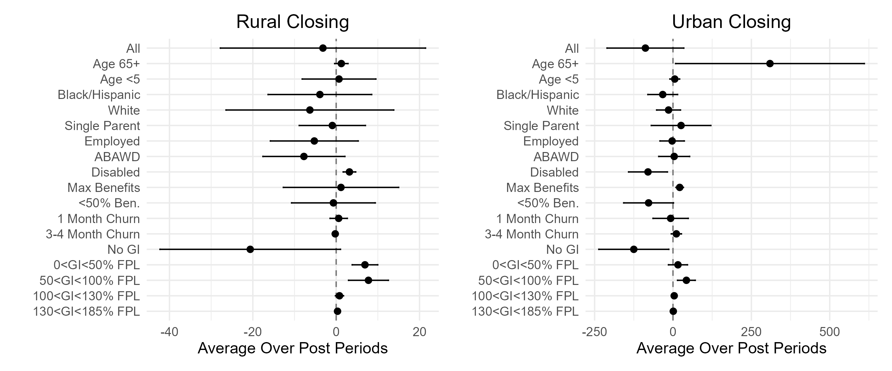].caption[
**Data Source:** SNAP Administrative Data - various states and years.
]

- **Key Takeaway:** Cases with no gross income fell the most.

---

# \# of New SNAP Clients
## Office Openings
.smallest[]
.pull-left[

.center[
```{r , include=T, echo = F}
d<-data.frame(Type= c('Distance','Model','Avg. Estimate','Baseline Y','Event Study'), 
               op_rur = c("0-1","TWFE","35.9***<br/>(11.9)","153",'
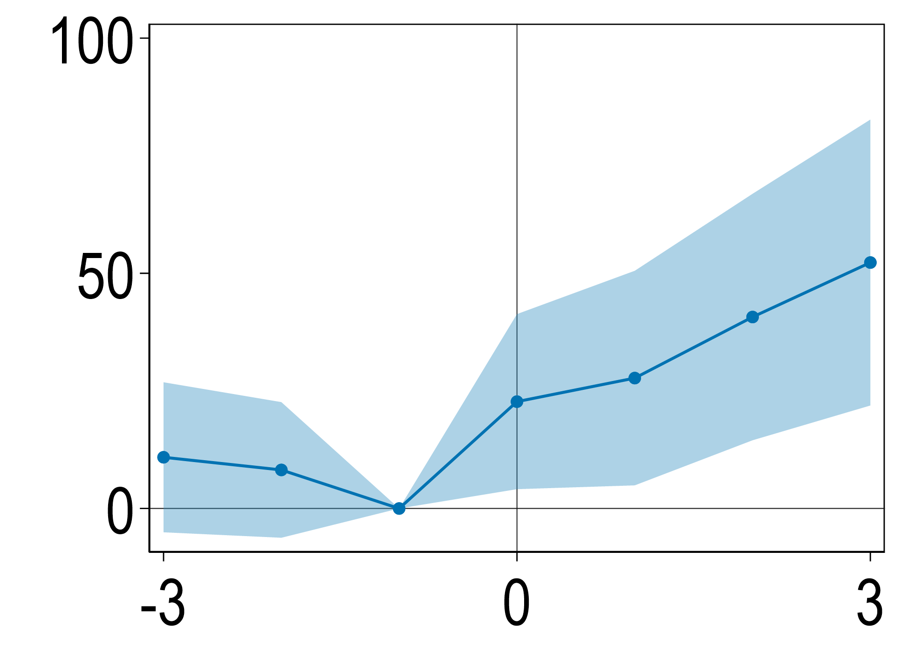'),
               op_urb = c("0-1","TWFE","294.2***<br/>(60.7)","466",'
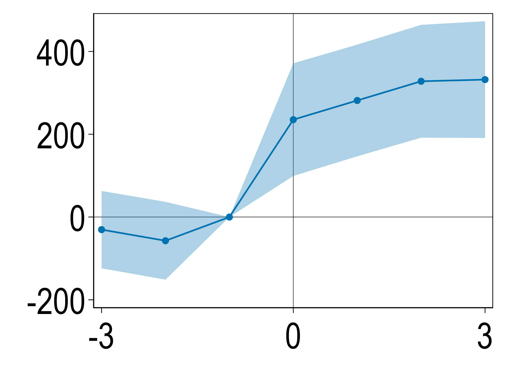')
)


d %>%
  kbl(booktabs = TRUE,col.names = c("","Opening<br/>Rural","Opening<br/>Urban"), escape = FALSE,
      align=c("c", 'c','c'), position="center"
  ) %>%
  kable_paper(full_width = FALSE) %>%
  kable_styling(full_width = FALSE, position="center") %>% 
  row_spec(0, align = "c") %>%
  column_spec(1, width = "5em") %>%
  column_spec(2, width = "7em",background ="#FDDBC7") %>%
  column_spec(3, width = "7em",background ="#D1E5F0") %>%
  row_spec(5, background ="white")
```
]
.caption[.center[
**Data Source:** SNAP Administrative Data - various states and years.
]]

]
.pull-right[
- **Rural & Urban Counties**: Large, immediate impacts that increase with time.

- By **three years** after opening:

  - .hi-red[Rural Counties]: 53 additional SNAP clients (.red[35% increase]).
  
  - .hi-blue[Urban Counties]: 332 additional SNAP clients (.blue[71% increase]).
]

---

# \# of New SNAP Clients
## Heterogeneity by Gross Income

.pull-left[
.center[
**Opening, Rural**
```{r out.width = '100%', echo = F}
"figs/op_rur_fplhet_ES.png" %>%
 image_read() %>%
 crop(bottom = 0, top = 0, left=0, right=0)
```
]
]

.pull-right[
.center[
**Opening, Urban**
```{r out.width = '100%', echo = F}
"figs/op_urb_fplhet_ES.png" %>%
 image_read() %>%
 crop(bottom = 0, top = 0, left=0, right=0)
```

]
]
.caption[.center[
**Data Source:** SNAP Administrative Data - various states and years.
]]

- Biggest participation impacts for cases without gross income.

- .hi-green[Evidence of improved targeting].

---
# \# of New SNAP Clients
## Heterogeneity
```{r , include=F, echo = F}
#Rural Opening
val <- read.csv(file = 'temp/forest_plot_op_rur.csv')

var <- rev(c("All","Age 65+","Age <5","White","Black/Hispanic","Single Parent","Employed","ABAWD","Disabled","Max Benefits","<50% Ben.","1 Month Churn","3-4 Month Churn","No GI","0<GI<50% FPL","50<GI<100% FPL","100<GI<130% FPL","130<GI<185% FPL"))

Label <- factor(var, 
               order = TRUE,
               levels =rev(c("All","Age 65+","Age <5","White","Black/Hispanic","Single Parent","Employed","ABAWD","Disabled","Max Benefits","<50% Ben.","1 Month Churn","3-4 Month Churn","No GI","0<GI<50% FPL","50<GI<100% FPL","100<GI<130% FPL","130<GI<185% FPL")))
              
data_rur_op <- data.frame(Label,val)

p_rur_op <- ggplot(data=data_rur_op, aes(y=Label, x=est, xmin=ci_l, xmax=ci_u))+ 
      geom_point(color="Black", size=2)+ 
      geom_errorbarh(height=.1)+ #adds the CIs
labs(y = '', x="Average Over Post Periods") +
#adding a vertical line at the effect = 0 mark
geom_vline(xintercept=0, color="black", linetype="dashed", alpha=.5)+
#thematic stuff
ggtitle("Rural Opening")+
theme_minimal()+
theme(text=element_text(family="Times",size=12, color="black"))+
theme(panel.spacing = unit(1, "lines"))+
theme(plot.title = element_text(hjust = 0.5))

#Urban Opening
val <- read.csv(file = 'temp/forest_plot_op_urb.csv')
              
data_urb_op <- data.frame(Label,val)

p_urb_op <- ggplot(data=data_urb_op, aes(y=Label, x=est, xmin=ci_l, xmax=ci_u))+ 
      geom_point(color="Black", size=2)+ 
      geom_errorbarh(height=.1)+ #adds the CIs
labs(y = '', x="Average Over Post Periods") +
#adding a vertical line at the effect = 0 mark
geom_vline(xintercept=0, color="black", linetype="dashed", alpha=.5)+
#thematic stuff
ggtitle("Urban Opening")+
theme_minimal()+
theme(text=element_text(family="Times",size=12, color="black"))+
theme(panel.spacing = unit(1, "lines"))+
theme(plot.title = element_text(hjust = 0.5))

p_rur_op + p_urb_op
ggsave(
  "heteroFX_op.png",
  path = 'figs/',
  width = 24,height = 10,units = c("cm")
)
```

.center[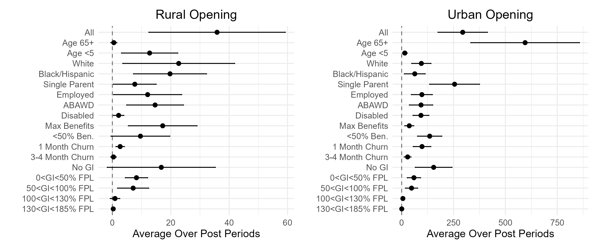].caption[
**Data Source:** SNAP Administrative Data - various states and years.
]

- Increases in program participation across many subgroups.


---
# Take-Away

- SNAP office openings/closings generates meaningful differences in access.

- These differences in access substantially impact participation rates (.red[particularly for cases without income]).


- **Closing offices** experience an uptick in cases during the closing year. Possibly clearing out application queue. Subsequent modest declines in participation (.blue[urban counties]). 
  
- **Opening offices** experience large persistent increases in participation.

---
class: inverse, middle
count: false 

# Robustness

---
#Robustness

Next, we test robustness to changing:

1. **Model:** Use .red[de Chaisemartin and D'Haultfœuille, 2020] estimator that is robust to heterogeneous treatment effects.
  
1. **Overlap:** Allowing cases to be counted multiple times if within a mile of multiple offices.
  
1. **Outcome:** Measuring number of cases as opposed to number of clients.

--

<br/>

**Summary:** Results are not substantially impacted.

---

# Rural Closings - Robustness
.center[
```{r , include=T, echo = F}
d<-data.frame(Type= c('Distance','Model',"Overlap",'Avg. Estimate','Baseline Y',"Main Specification",'Event Study'), 
               cl_rur = c("0-1","TWFE","No","-3.2<br/>(12.6)","223.6","X",'
'),
               cl_urb = c("0-1","deCh/DH (AER)","No","13.9<br/>(13.0)","204.5","",'
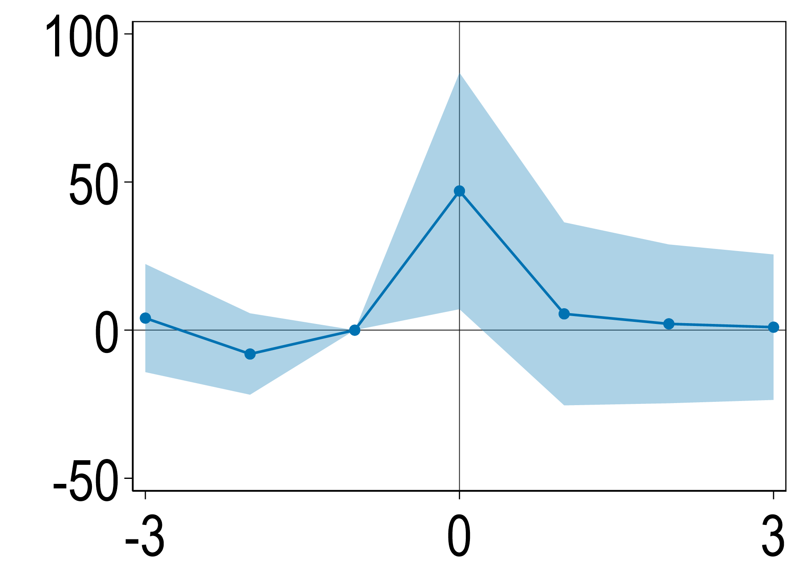'),
               op_rur = c("0-1","TWFE","Yes","-10.1<br/>(14.5)","295.4","",'
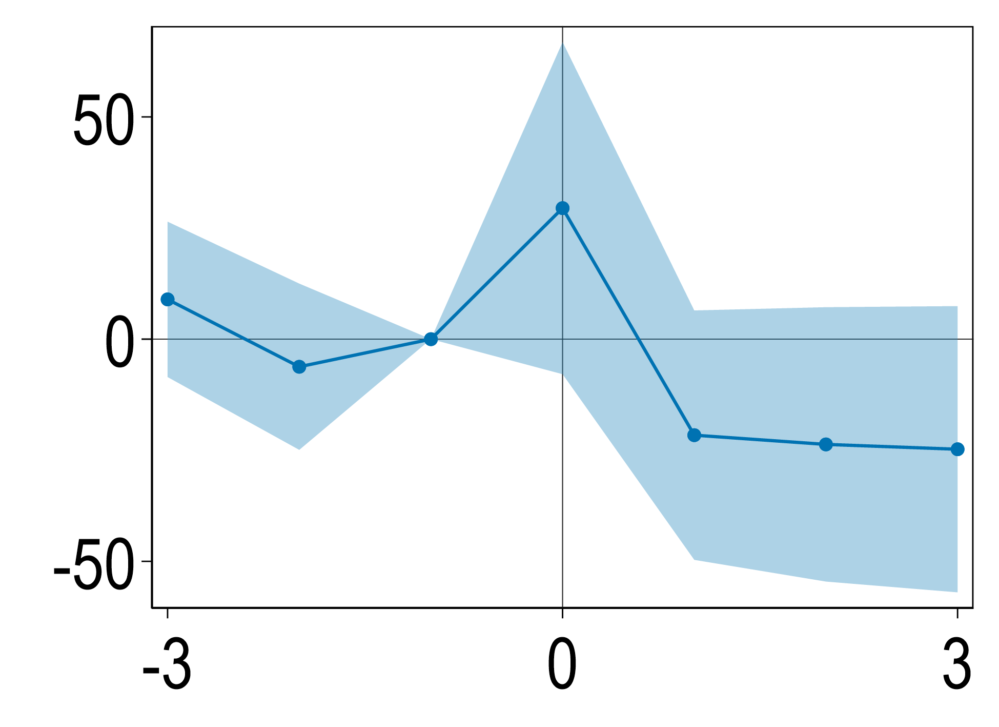'),
               op_urb = c("0-1","TWFE","No","-6.6<br/>(7.7)","121.6","",'
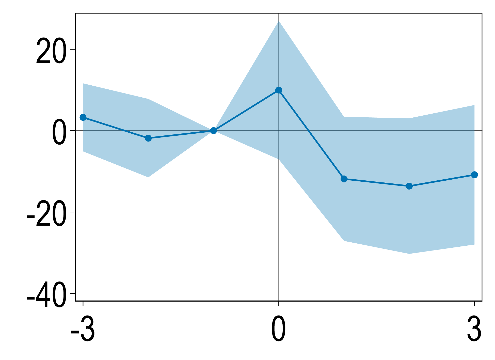')
)


d %>%
  kbl(booktabs = TRUE,col.names = c("","New<br/>Clients","New<br/>Clients","New<br/>Clients","New<br/>Cases"), escape = FALSE,
      align=c("c", 'c','c','c','c'), position="center"
  ) %>%
  kable_paper(full_width = FALSE) %>%
  kable_styling(full_width = FALSE, position="center") %>% 
  row_spec(0, align = "c") %>%
  column_spec(1, width = "4em") %>%
  column_spec(2, width = "7em",background ="#FDDBC7") %>%
  column_spec(3, width = "7em") %>%
  column_spec(4, width = "7em") %>%
  column_spec(5, width = "7em") %>%
  row_spec(7, background ="white")
```
]
.caption[.center[
**Data Source:** SNAP Administrative Data - various states and years.
]]
---

# Urban Closings - Robustness
.center[
```{r , include=T, echo = F}
d<-data.frame(Type= c('Distance','Model',"Overlap",'Avg. Estimate','Baseline Y','Main Specification','Event Study'), 
               cl_rur = c("0-1","TWFE","No","-88.0<br/>(62.5)","1,020","X",'
'),
               cl_urb = c("0-1","deCh/DH (AER)","No","84.2<br/>(82.9)","856","",'
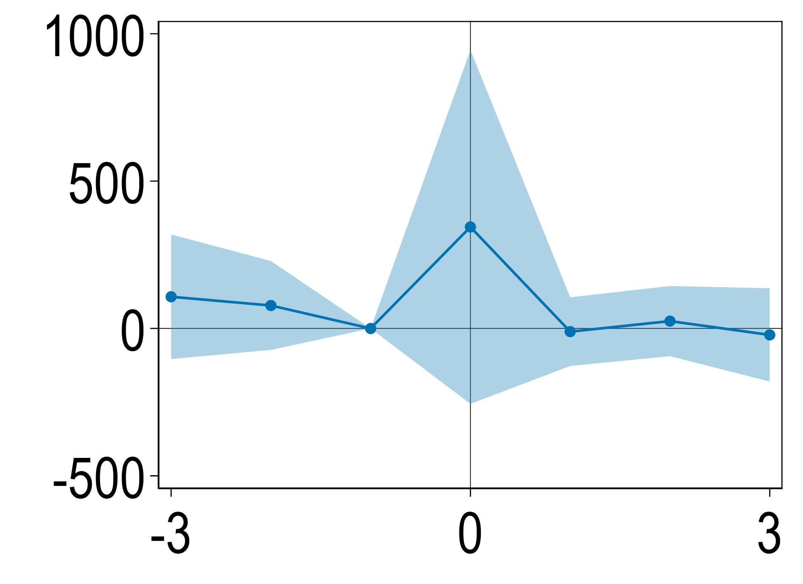'),
               op_rur = c("0-1","TWFE","Yes","-101.9<br/>(67.3)","1,250","",'
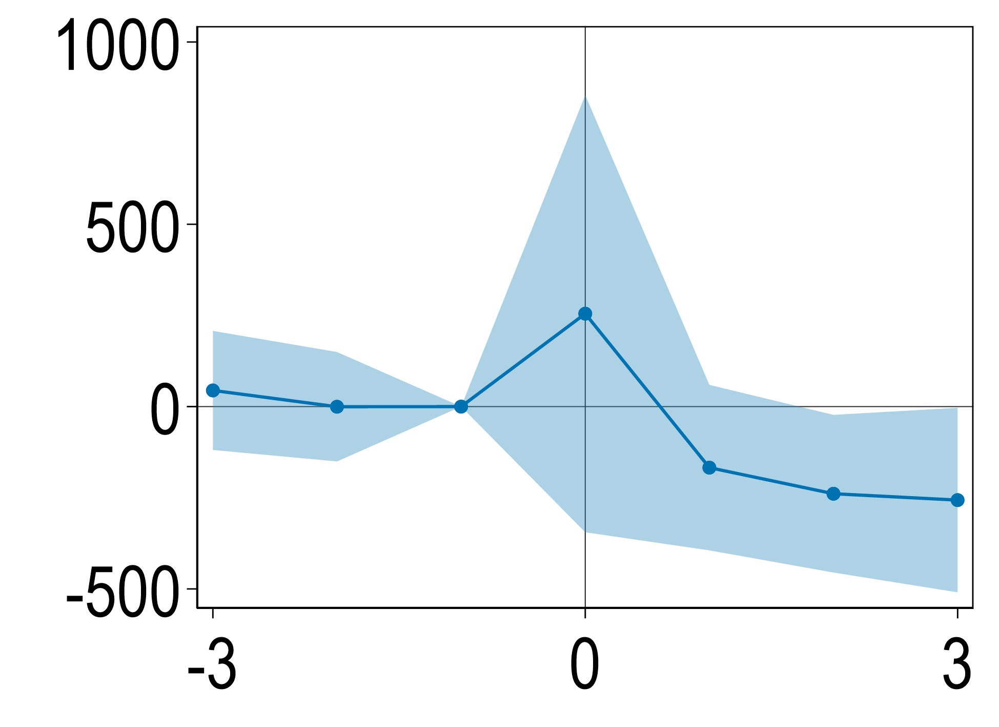'),
               op_urb = c("0-1","TWFE","No","-78.7<br/>(48.0)","651","",'
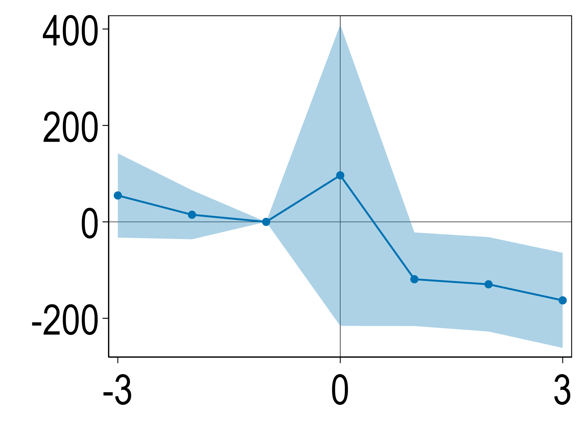')
)


d %>%
  kbl(booktabs = TRUE,col.names = c("","New<br/>Clients","New<br/>Clients","New<br/>Clients","New<br/>Cases"), escape = FALSE,
      align=c("c", 'c','c','c','c'), position="center"
  ) %>%
  kable_paper(full_width = FALSE) %>%
  kable_styling(full_width = FALSE, position="center") %>% 
  row_spec(0, align = "c") %>%
  column_spec(1, width = "4em") %>%
  column_spec(2, width = "7em",background ="#FDDBC7") %>%
  column_spec(3, width = "7em") %>%
  column_spec(4, width = "7em") %>%
  column_spec(5, width = "7em") %>%
  row_spec(7, background ="white")
```
]
.caption[.center[
**Data Source:** SNAP Administrative Data - various states and years.
]]
---

# Rural Openings - Robustness
.center[
```{r , include=T, echo = F}
d<-data.frame(Type= c('Distance','Model',"Overlap",'Avg. Estimate','Baseline Y','Main Specification','Event Study'), 
               cl_rur = c("0-1","TWFE","No","35.9***<br/>(11.9)","153","X",'
'),
               cl_urb = c("0-1","deCh/DH (AER)","No","26.5***<br/>(9.2)","144","",'
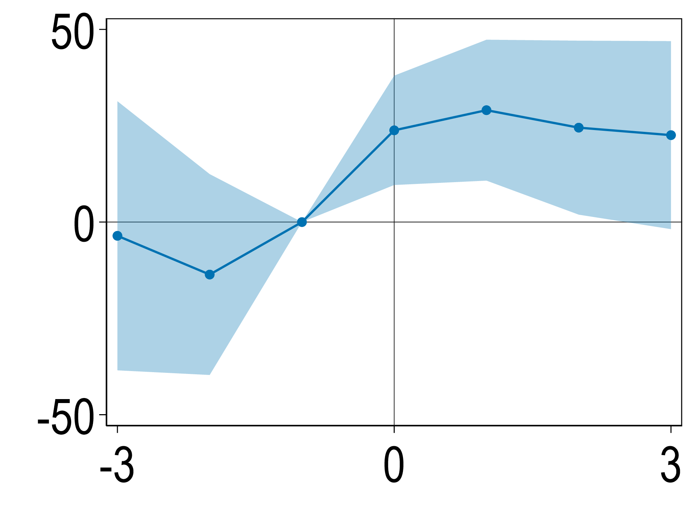'),
               op_rur = c("0-1","TWFE","Yes","26.7**<br/>(13.1)","235.2","",'
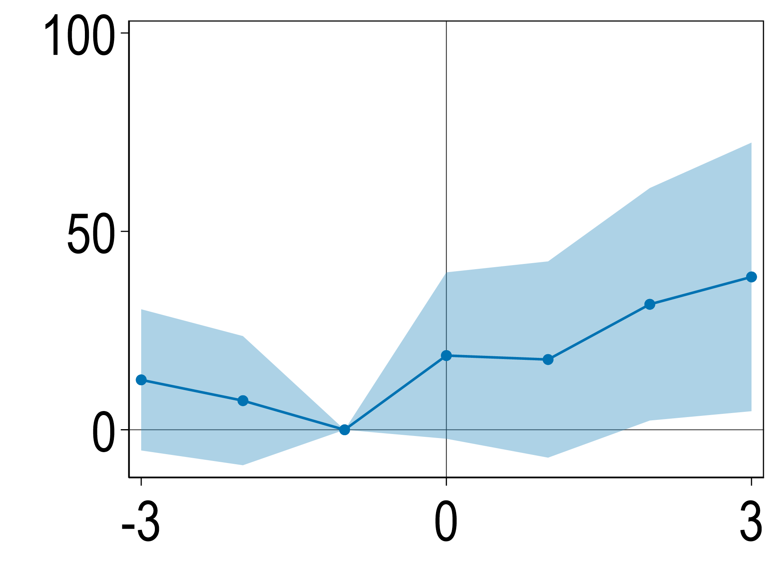'),
               op_urb = c("0-1","TWFE","No","20.2***<br/>(7.1)","121.6","",'
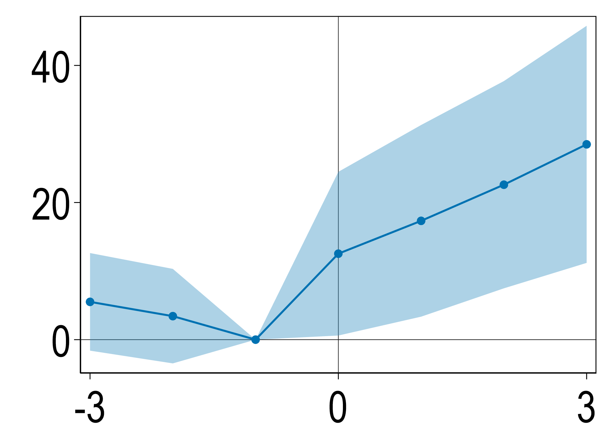')
)


d %>%
  kbl(booktabs = TRUE,col.names = c("","New<br/>Clients","New<br/>Clients","New<br/>Clients","New<br/>Cases"), escape = FALSE,
      align=c("c", 'c','c','c','c'), position="center"
  ) %>%
  kable_paper(full_width = FALSE) %>%
  kable_styling(full_width = FALSE, position="center") %>% 
  row_spec(0, align = "c") %>%
  column_spec(1, width = "4em") %>%
  column_spec(2, width = "7em",background ="#FDDBC7") %>%
  column_spec(3, width = "7em") %>%
  column_spec(4, width = "7em") %>%
  column_spec(5, width = "7em") %>%
  row_spec(7, background ="white")
```
]
.caption[.center[
**Data Source:** SNAP Administrative Data - various states and years.
]]
---

# Urban Openings - Robustness
.center[
```{r , include=T, echo = F}

d<-data.frame(Type= c('Distance','Model',"Overlap",'Avg. Estimate','Baseline Y','Main Specification','Event Study'), 
               cl_rur = c("0-1","TWFE","No","294.2***<br/>(60.7)","466","X",'
'),
               cl_urb = c("0-1","deCh/DH (AER)","No","508.4<br/>(317.3)","424.3","",'
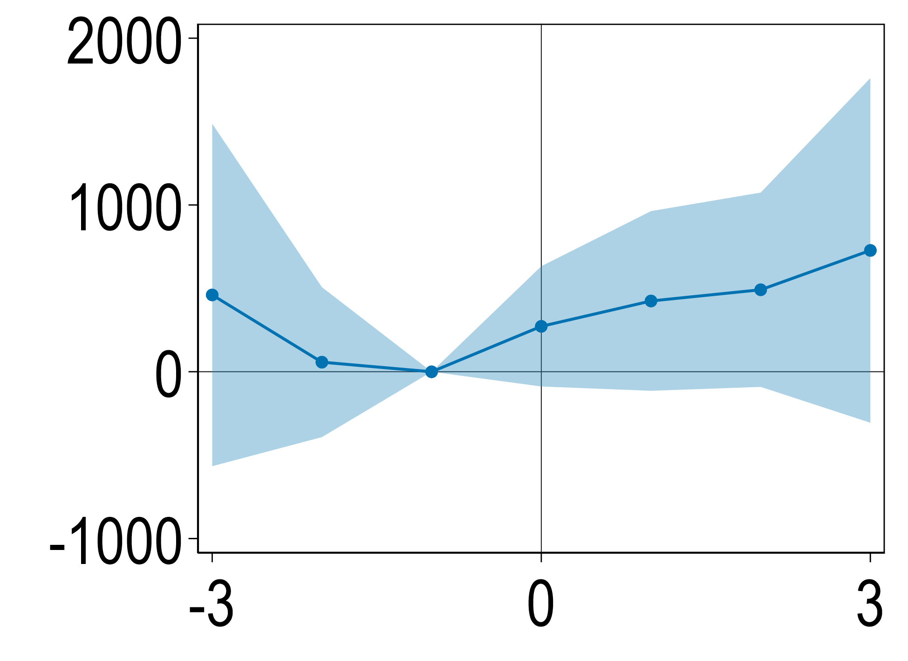'),
               op_rur = c("0-1","TWFE","Yes","281.8***<br/>(74.1)","711.6","",'
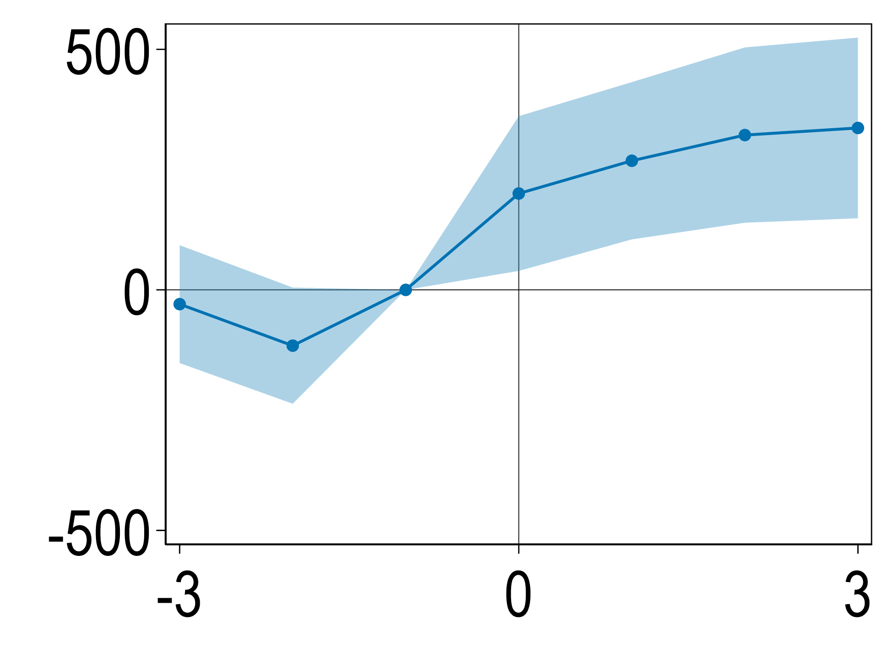'),
               op_urb = c("0-1","TWFE","No","160.0***<br/>(33.1)","241.6","",'
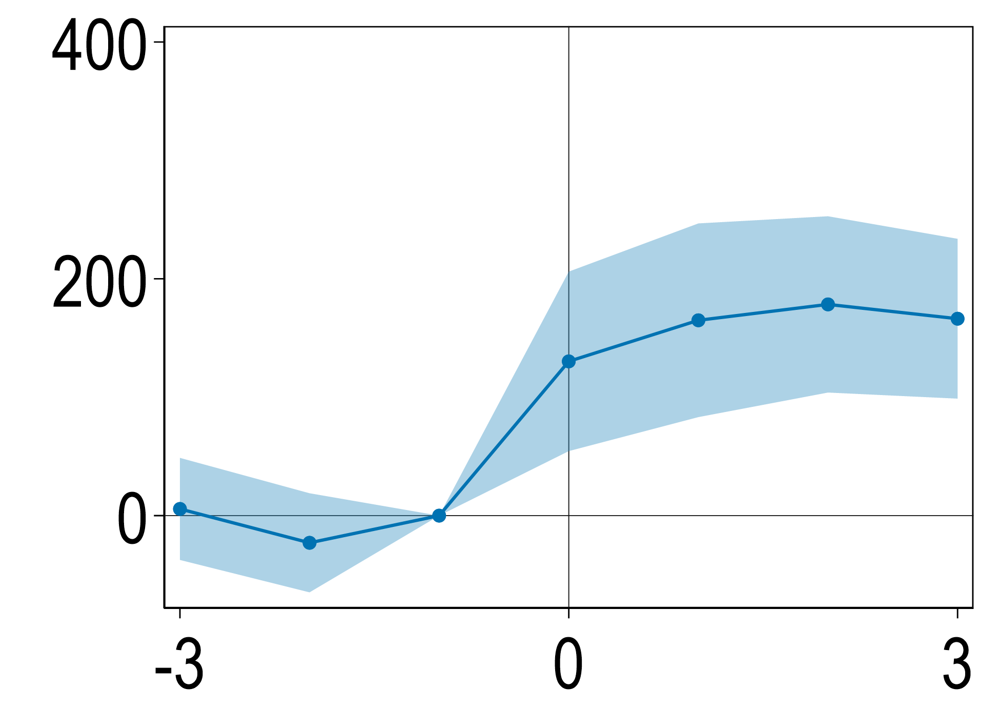')
)


d %>%
  kbl(booktabs = TRUE,col.names = c("","New<br/>Clients","New<br/>Clients","New<br/>Clients","New<br/>Cases"), escape = FALSE,
      align=c("c", 'c','c','c','c'), position="center"
  ) %>%
  kable_paper(full_width = FALSE) %>%
  kable_styling(full_width = FALSE, position="center") %>% 
  row_spec(0, align = "c") %>%
  column_spec(1, width = "4em") %>%
  column_spec(2, width = "7em",background ="#FDDBC7") %>%
  column_spec(3, width = "7em") %>%
  column_spec(4, width = "7em") %>%
  column_spec(5, width = "7em") %>%
  row_spec(7, background ="white")
```
]
.caption[.center[
**Data Source:** SNAP Administrative Data - various states and years.
]]


---

# Conclusion

- Access to SNAP offices .hi-green[substantially increases program participation].

- Particularly important for families without income (i.e., .hi-green[improved targeting]).

- Interesting because many states are fully online with active help phone lines.

- Face-to-face assistance may provide additional aid overcoming transaction costs (.smallest[.red[Wu, 2021]])

- Policy implications to increase in-person assistance for applications.
  - Similar to mobile WIC clinics

---
# Next Steps

- Qualitatively examine mechanisms for why offices may matter.

- Similar analysis for distance to SNAP-authorized retailers and businesses more generally (D&B).

- Robustness to population changes.

- Mobility and case composition outcomes.

- Use as IV to explore impact of SNAP on labor supply, cross-program participation, and health.

---
class: white-slide, center, middle
count: false 

.huge[**Thank you**]

---
count: false 

# References

```{r, results='asis', echo=FALSE}
PrintBibliography(bib, start = 1, end = 4)
```

---
count: false

# References

```{r, results='asis', echo=FALSE}
PrintBibliography(bib, start = 5, end = 8)
```
---
count: false

# References

```{r, results='asis', echo=FALSE}
PrintBibliography(bib, start = 9, end = 12)
```
---
count: false

# References

```{r, results='asis', echo=FALSE}
PrintBibliography(bib, start = 13, end = 16)
```

---
count: false

# References

```{r, results='asis', echo=FALSE}
PrintBibliography(bib, start = 17, end = 20)
```
---
count: false

# References

```{r, results='asis', echo=FALSE}
PrintBibliography(bib, start = 21, end = 21)
```